# UK businesses 2024 report. Python

*Emma Schenegg
15-02-2026*

## Material used 

### Datasets
The four datasets used in this project were obtained from the publicly available UK Statistical Bulletins, specifically the ONS 2024 annual report on Business Demography.
From this report, four datasets were downloaded:

1.	**Business Closures (2024)**: This dataset contains the percentage of businesses ceasing activity in 2024 across 361 areas in the UK. [dataset](https://www.ons.gov.uk/explore-local-statistics/indicators/deaths-of-enterprises)
   
2.	**New Business Registrations (2024)**: This dataset reports the percentage of businesses newly registered for VAT and/or PAYE across the same 361 areas. [dataset](https://www.ons.gov.uk/explore-local-statistics/indicators/births-of-new-enterprises)
   
3.	**High Employment Growth (2024)**: This dataset provides the percentage of businesses with an average employment growth exceeding 20% per year over a three-year period in 2024, for the 361 areas. [dataset](https://www.ons.gov.uk/explore-local-statistics/indicators/high-growth-enterprises)
   
4.	**Business Turnover and Employment (2019–2024)**: This dataset records business turnover and employment from 2019 to 2024 for the 361 areas. To ensure compatibility with the other datasets, only data for the year 2024 was retained. [dataset](https://www.ons.gov.uk/explore-local-statistics/indicators/active-businesses)
   

### Maps
For the following analysis, since the areas in the dataset and in the GeoJSON file found on the ONS website represent a mix of UK administrative units, including London boroughs, local authority districts, and one county, the corresponding GeoJSON file has been uploaded:  

In order to analyse the choropleth maps created in this project, I used publicly available maps that are easier to read than the raw GeoJSON file and that are delimited in the same way as both the dataset and the GeoJSON file. One map is for Northern Ireland: 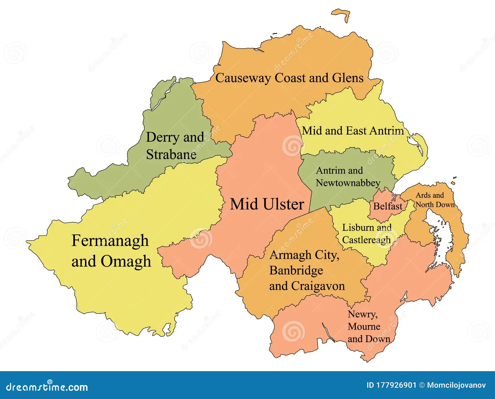 and one for the rest of the United Kingdom 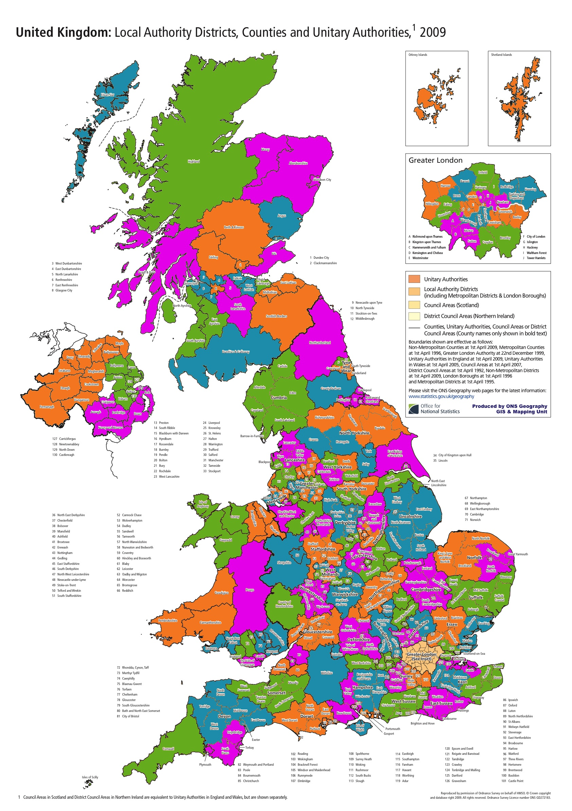. The separate Northern Ireland map is included because the first map boundaries shown in the general UK map differ from those in the main GeoJSON file, ensuring consistency with the GeoJSON boundaries used in the analysis.

# Loading and cleaning the Data

First I imported the **pandas** library to work with Excel files and DataFrames and gave it the short nickname 'pd' to be able to use all pandas functions (read_excel, DataFrame, drop, etc.)

```python
import pandas as pd
```

I then created and defined four separate pandas DataFrames from the 4 sheets in original Excel file.

```python
active_businesses = pd.read_excel("Businesses_2024.xlsx", sheet_name="Active businesses 2024")
new_businesses = pd.read_excel("Businesses_2024.xlsx", sheet_name="New businesses 2024")
closed_businesses = pd.read_excel("Businesses_2024.xlsx", sheet_name="Death businesses")
high_growth_businesses = pd.read_excel("Businesses_2024.xlsx", sheet_name="High growth businesses 2024")
```

Next, I used the info() function to view the variables present in each dataset as well as data types and number of nulls, and rows.

```python
active_businesses.info()
new_businesses.info()
closed_businesses.info()
high_growth_businesses.info()
```
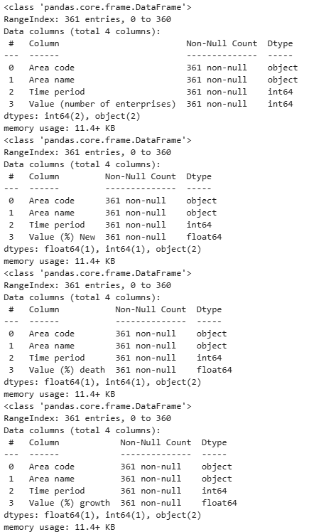
All data types are consistent and correct. No null values. Each column contains 361 entries.

Next, I used the head() function to have a quick preview of the structure of the datasets.
```python
active_businesses.head()
```
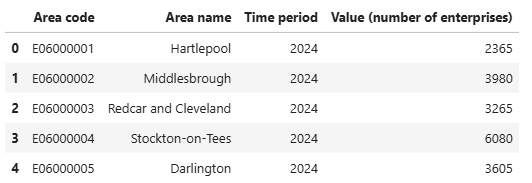

```python
new_businesses.head()
```
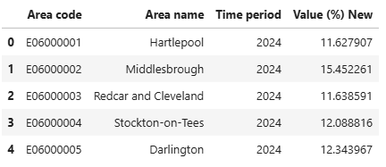
```python
closed_businesses.head()
```
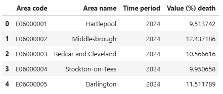
```python
high_growth_businesses.head()
```
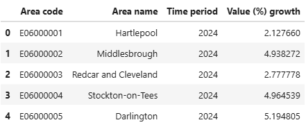

Since the dataset was for the 2024 period, I used the unique() function to ensure that only data from 2024 was included.

I then created a dictionary to store all four business datasets, then loop through each dataset to display its name and the unique values in the "Time period" column.

```python
tables = {
    "active_businesses": active_businesses,
    "new_businesses": new_businesses,
    "closed_businesses": closed_businesses,
    "high_growth_businesses": high_growth_businesses,
}

for name, df in tables.items():
    print(name, df["Time period"].unique())
```
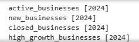

All values in the "Time period" columns indicate 2024; therefore, the column "Time period" was removed as it no longer needed.

```python
active_businesses.drop(columns="Time period", inplace=True)
new_businesses.drop(columns="Time period", inplace=True)
closed_businesses.drop(columns="Time period", inplace=True)
high_growth_businesses.drop(columns="Time period", inplace=True)
```

I then created one table that combined all 4 variables by Area name and Area code.

```python
merged1 = pd.merge(active_businesses, new_businesses, on =["Area name","Area code"], how="outer")
merged2= pd.merge(merged1, closed_businesses, on=["Area name","Area code"], how="outer")
final_table= pd.merge(merged2, high_growth_businesses, on=["Area name", "Area code"], how="outer")
```

Then, I used the head() function on the final table to ensure all variables are included.

```python
final_table.head(400)
```
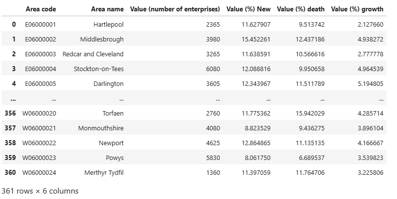

Next, I used isna() and sum() functions to count the total number of missing values in each column of the dataset.

```python
final_table.isna().sum()
```
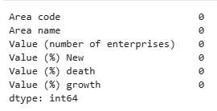

Then, the info() function was used on the final dataset to verify the number of rows matches the individual datasets and that the data types are correct.

```python
final_table.info()
```
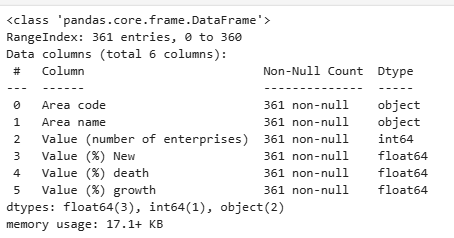

The duplicated() function was used to see if any rows appear more than once.

```python
final_table.duplicated()
```
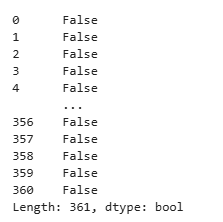

The strip() function was used to remove and potential unwanted spaces.

```python
final_table['Area name'] = final_table['Area name'].str.strip()
```
Since the datasets have been combined, there are no nulls or duplicates, and all variable types are correct and consistent. The analysis phase can now begin.

# Analysis

The decribe() function was used to generate summary statistics for the dataset.

```python
final_table.describe()
```
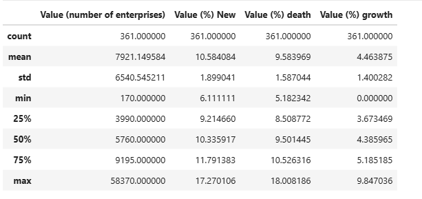

The dataset comprises 361 UK areas across all variables. On average, each area contains approximately 7,921 enterprises, although this figure varies substantially, as indicated by a high standard deviation (6,541). The number of enterprises ranges from a minimum of 170 to a maximum of 58,370, highlighting significant disparities in business concentration across regions.

The mean percentage of newly registered businesses is 10.58%, with most areas falling between 9.21% (25th percentile) and 11.79% (75th percentile). This suggests moderate but consistent business formation activity across the UK.

Business death rates average 9.58%, slightly lower than the rate of new business registrations. However, the maximum value reaches 18.01%, indicating that some areas experience notably higher levels of business closure.

The business growth rate, defined as the percentage of enterprises achieving employment growth greater than 20% per year over a three-year period, has a mean of 4.46%. Growth rates are relatively low compared to entry and exit rates, with some areas recording no high-growth firms, while the highest observed value is 9.85%.

Overall, the statistics suggest considerable regional variation in business scale and dynamics, with business creation marginally exceeding business closure on average, and a relatively small proportion of firms achieving high levels of growth.


Next, seaborn (Data visualisation library for statistical plots) was loaded.
```python
import seaborn as sns
```

A new variable was created in order to calculate the net change in businesses for each region to capture the net effect of business creation and closure in one metric, by subtracting the percentage of business deaths from the percentage of new businesses

```python
final_table['net change'] = final_table['Value (%) New'] - final_table['Value (%) death']
```

```python
print(final_table)
```
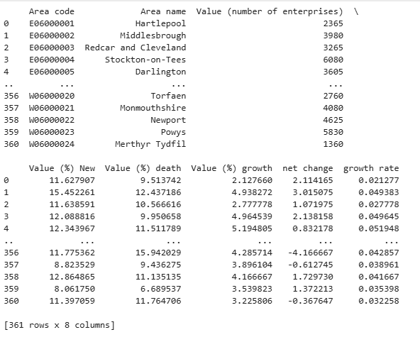

Folium (To create and display map) and json (To read and parse the GeoJSON map found on the ONS website) were loaded.

```python
import folium
import json
```

The rest of this analysis will use choropleth maps. Before returning to the business growth analysis and the exploration of the rest of the factors, we need to ensure that the area names in the GeoJSON file and in the dataset match exactly.

```python
with open("UKmap.geojson", "r") as f: # Use 'with' to automatically close the file. 'r' to read the file.
    uk_geo = json.load(f) # With the 'with' function the object assigned (here 'f') is temporary and only exist in the 'with' block.

uk_geo.keys()
```

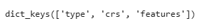

The uk_geo dictionary has three top-level keys. **type** indicates what kind of GeoJSON object this is. **Crs** (Coordinate Reference System) indicates how latitude/longitude coordinates are defined. **Features** correspond to a list containing all the geographic features (polygons, points, etc.) that make up the map.

We will now look at the structure of the file.

```python
first_feature = uk_geo["features"][0] #use [0] to get the first element as "features" is a list.
print(first_feature)
```
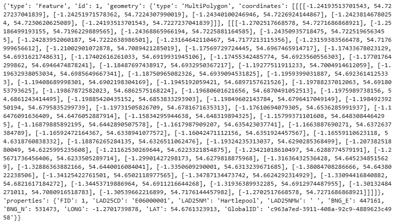

*We can see that in the JSON map, the area names are under properties ["LAD25NM"]. **LAD** stands for 'Local Authority District', '25' comes from the 1995 standard boundary coding system used by the UK Office for National Statistics (ONS) and NM stands for 'Name'.*

To create a complete chloropleth map, the area names in the dataset must match exactly with the area names in the GeoJSON file. Any mismatch will cause the map to miss or fail to display those areas. Therefore we will now creates a set of unique area names from 'final_table', with leading/trailing whitespace removed.

```python
data_names = set(final_table["Area name"].str.strip())
## 'set()' function keeps only unique values. 
## '.str' to call string on the whole pandas Series rather than an object.
```

And create a set of unique area name from 'f' with leading/trailing whitespaces removed.

```python
geo_names = {
    f["properties"]["LAD25NM"].strip()
    for f in uk_geo["features"] # loop defines f and goes through each feature in the 'features' list and extract f["properties"]["LAD25NM"].strip()
} ## Using {} with values (not empty) creates a set in Python that keeps only unique values. strip() removes any extra spaces from the area names found under properties["LAD25NM2] in the GeoJSON file.

```

Now we will creates variables that highlight the discrepancies between the areas names in the GeoJSON file and the dataset.

```python

missing_in_geo = data_names - geo_names # area names in dataset but not in GeoJSON.

missing_in_data = geo_names - data_names # area names in GeoJSON but not in dataset.

missing_in_geo, missing_in_data # shows the differences between area names in the dataset and the GeoJSON.
```
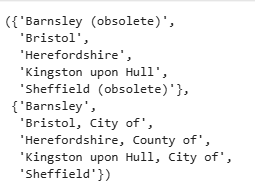

Some discrepancies have been found in area name syntax between the dataset and the GeoJSON file.
In the dataset Barnsley and Sheffield are followed by the mention (obsolete) unlike in the GeoJSON file.
In the GeoJSON file Bristol, Herefordshire and Kingston upon Hull are followed by 'City of' or 'County of' unlike in the dataset.

Let's remove the extra ' (obsolete)' text from the dataset area names.

```python
final_table["Area name"] =(
    final_table ["Area name"]
    .str.replace("\\s*\\(obsolete\\)","", regex=True).str.strip()
)

## "\\(" and "\\)" means literal "(" or ")" as opposed to ( or ) used for grouping. '\\s*' removes any spaces before '(obsolete)'. Use double backslashes to avoid any confusion with regex symbols.
## Regex = regular expression: find text that look like this pattern.
```

We will now change the remaining three area names to match those used in the GeoJSON file.

```python
final_table.loc[final_table["Area name"] == "Bristol", "Area name"]= "Bristol, City of" #.loc is how pandas select/updates specific rows and columns. = > assignment / == > Comparison
final_table.loc[final_table["Area name"] == "Herefordshire", "Area name"]= "Herefordshire, County of"
final_table.loc[final_table["Area name"] == "Kingston upon Hull", "Area name"]= "Kingston upon Hull, City of"
```

Now that the datasets have been cleaned and the area names in both match, we can begin the detailed analysis.

## Number of enterprises

```python
import matplotlib.pyplot as plt #for plots
```

Distribution of number of enterprise (boxplot).

```python
sns.boxplot(x='Value (number of enterprises)', data=final_table)

plt.title('Distribution and Dispersion of Areas by Enterprise Counts')
plt.show()
```
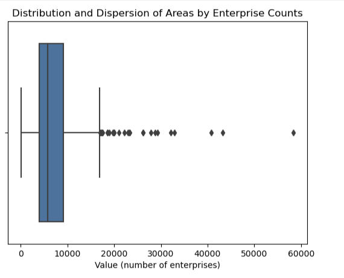

The boxplot shows that the median is relatively low compared to the maximum value, indicating that more than 50% of UK areas host a relatively small number of enterprises.
The box (interquartile range) is narrow relative to the full x-axis range, suggesting that the middle 50% of areas are quite similar in terms of enterprise numbers and that variation among typical areas is limited.
The distribution is positively skewed, with a long right-hand tail extending toward higher values. Numerous high-end outliers are present, reflecting major cities with exceptionally large numbers of enterprises.
Overall, the boxplot indicates a highly right-skewed distribution of enterprises across UK areas. While the median number of enterprises is relatively low, a small number of regions exhibit exceptionally high values, as shown by the many upper-end outliers. This pattern suggests substantial regional inequality in business concentration, with most areas hosting modest numbers of enterprises and a few metropolitan hubs dominating overall business activity. Due to the presence of extreme values, the median provides a more representative measure of central tendency than the mean.

Given the highly right-skewed distribution and the presence of extreme values, a logarithmic scale was applied to improve visual interpretation of the central distribution and facilitate comparison across typical UK areas.

```python
sns.boxplot(x='Value (number of enterprises)', data=final_table)

plt.xscale('log')
plt.title('Number of Areas by Enterprise Count (Log Scale)')
plt.show()
```
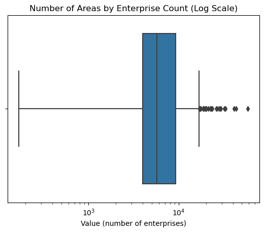

The logarithmic boxplot shows that the median lies close to 10,000, indicating that a typical area hosts approximately 8,000–10,000 enterprises.
Although the distribution is right-skewed in absolute terms, the logarithmic scale reveals greater relative dispersion among smaller regions, as indicated by the longer left whisker.
The interquartile range (25th–75th percentile) spans less than one order of magnitude (a ten-fold difference), suggesting moderate variation among most UK regions.

We will now creates a histogram to visualise the distribution of the number of enterprises across UK areas in 2024.

```python
final_table['Value (number of enterprises)'].hist(bins=25, color='orange')

plt.title('Number of Areas by Enterprise Count')
plt.show()
```
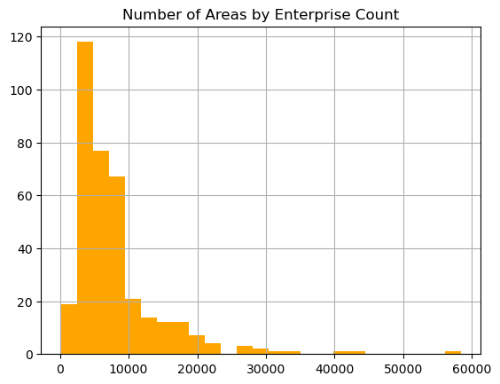

The histogram indicates that most regions have between 2,500 and 5,000 enterprises.
The distribution is strongly right-skewed, showing that most regions have relatively low enterprise counts, while a small number of regions exhibit very high concentrations of enterprises. This suggests that the data are not normally distributed.

Next, we ranked UK areas by total enterprise count (highest to lowest) to highlight regions with the greatest business concentration.

```python
final_table.set_index('Area name')['Value (number of enterprises)'].sort_values(ascending=False)
```
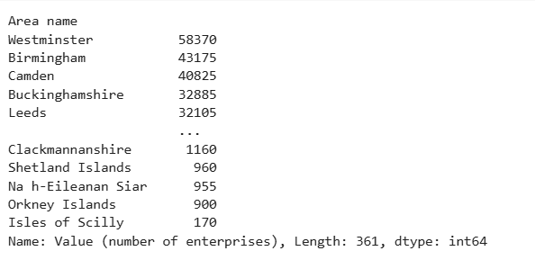

Westminster (London) is the local authority with the highest number of enterprises, recording a total of 58,370, followed by Birmingham (43,175) and the London borough of Camden (40,825).
In contrast, the UK areas with the lowest business concentration are predominantly smaller and more rural authorities. The Isles of Scilly recorded the lowest number of enterprises in 2024, with just 170 businesses, followed by Orkney Islands (900) and Na h-Eileanan Siar (955).

Next, a bar chart was created to display the top 10 areas with the highest number of enterprises.

```python
top_10_etrp = final_table.set_index('Area name')['Value (number of enterprises)'].sort_values(ascending =False).head(10)

top_10_etrp.plot(kind='barh', color='violet')
plt.xlabel('Value (%) number of enterprises')
plt.ylabel('Area name')
plt.title('Top 10 UK areas by number of enterprises')
plt.show()
```
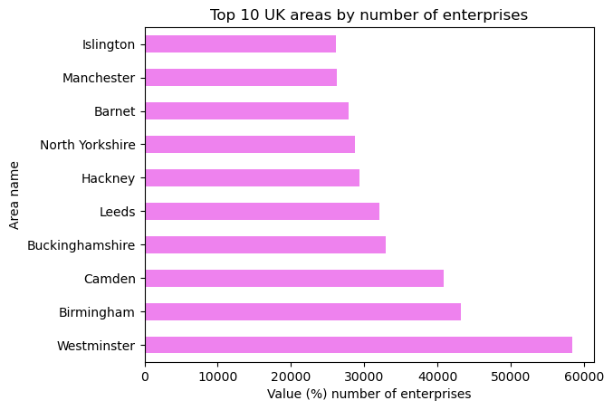

The bar chart highlights that, among the top 10 UK areas with the highest business concentration, several are London boroughs, including Westminster (55,000), Camden (42,000), Hackney (30,000), and Islington (30,000).

The remaining authorities are either geographically large areas, such as North Yorkshire (30,000), or major cities such as Birmingham (43,000) and Leeds (32,000).


A map was created, displaying the top 5 UK area with the highest number of enterprises and the lowest number of enterprises.

```python
Top_5_hne = final_table.nlargest(5, 'Value (number of enterprises)')
Top_5_lne = final_table.nsmallest(5, 'Value (number of enterprises)')
```
```python
Top_5_hne = set(Top_5_hne["Area name"])
Top_5_lne = set(Top_5_lne["Area name"])
```
```python
## Create base map
top5nemap = folium.Map(location=[54.5, -2], zoom_start=6)

folium.Choropleth(
    geo_data = 'UKmap.geojson',
    fill_color = 'Greys',
    fill_opacity = 0.2,
    line_opacity = 0.1,
    nan_fill_color = 'lightgray'
).add_to(top5nemap)
```
```python
def Color_map_ne(feature): # style_function(): < JavaScript naming convention  = camelCase
    area = feature['properties']['LAD25NM']

    if area in Top_5_hne: # Folium is a Python library built on JavaScript (camelCase) not python (snake_case)
        return{
            'fillColor':'green',
            'color':'black',
            'weight':1,
            'fillOpacity':0.8
        }

    elif area in Top_5_lne:
        return{
            'fillColor':'red',
            'color':'black',
            'weight':1,
            'fillOpacity':0.8
        }

    else:
        return{
            'fillColor':'transparent',
            'color':'transparent',
            'weight':0,
            'fillOpacity':0
        }
```
```python
folium.GeoJson( # using GeoJson because to use fine-grained, conditional styling per region, which Choropleth can’t do as flexibly.
    'UKmap.geojson',
    style_function = Color_map_ne
).add_to(top5nemap)
```
```python
top5nemap
```
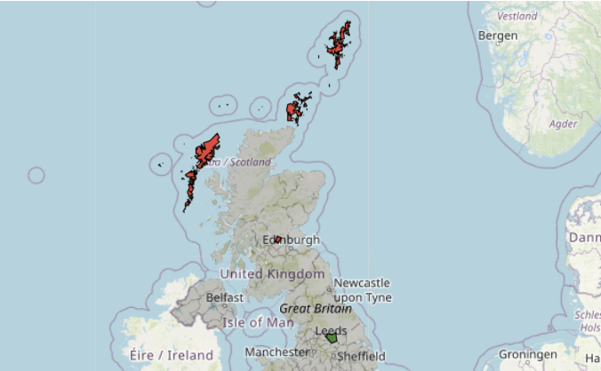

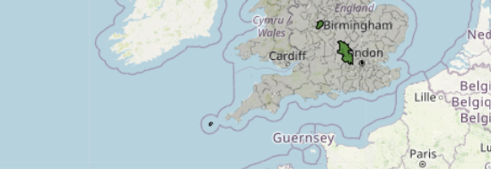

The map shows that among the five UK areas with the fewest businesses, four are on islands: the Isles of Scilly (England), Orkney Islands (Scotland), Shetland Islands (Scotland), and Eilean Siar (Scotland). The only mainland area in the top five for the lowest business numbers in 2024 is Clackmannanshire.
In contrast, the five UK areas with the most businesses are all concentrated around major cities, including London (Westminster and Camden), Buckinghamshire, Birmingham, and Leeds.


Next, a map showing the number of enterprises by area was created to see if any patterns in business distribution across regions appear.

```python
amap = folium.Map(location=[54.5, -2], zoom_start=6)

folium.Choropleth(
    geo_data="UKmap.geojson",
    data= final_table,
    columns=["Area name", "Value (number of enterprises)"],
    key_on="feature.properties.LAD25NM",
    fill_color='YlGn',
    fill_opacity = 0.7,
    line_opacity= 0.2,
    nan_fill_color="lightgray",
    legend_name = 'Number of enterprises'
).add_to(amap)
```
```python
amap
```
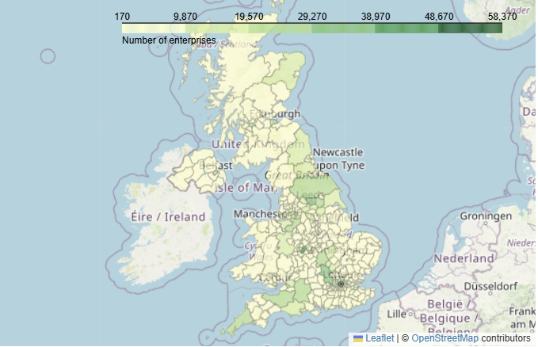

In 2024, most local authorities in the UK had between 170 and 9,890 enterprises, with some areas near major cities reporting much higher numbers. In England, Cornwall, Somerset, Wiltshire, and North Yorkshire recorded between 19,570 and 29,270 enterprises — relatively high compared to other regions, likely due to their larger geographic size.
In Scotland, aside from the major cities, Aberdeenshire had the highest number of enterprises, also ranging from 19,570 to 29,270.

## Growth rates
A boxplot was created to visualise the distribution of business growth rates.

```python
sns.boxplot(x='Value (%) growth', data=final_table)

plt.title('Distribution of Percentage Business Growth across Area')
plt.show()
```
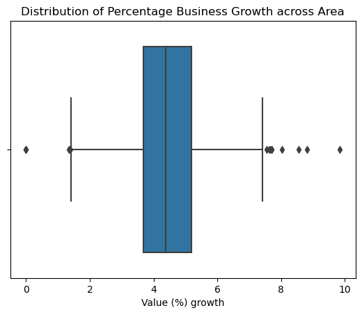

The whiskers extend from around 2%, indicating regions with lower levels of business growth, to around 8% representing regions with higher business growth rate.
The interquartile range is relatively narrow compared to the full x-axis range, suggesting that the middle 50% of areas exhibit similar levels of business growth. Most typical regions fall roughly between 4% and 5%, indicating limited variation among the majority of areas.
The boxplot shows that the median percentage of new businesses across UK is around 4%. The median lies roughly in the center of the distribution, indicating that approximately half of the UK areas recorded business growth rates above 4%, while the other half recorded lower rates.
The distribution is approximately symmetric, with the data being evenly spread out on both sides of the median and lower and upper halves of the data showing similar variability.
The plot indicates the presence of outliers at both ends of the distribution, indicating variability, with some regions experiencing exceptionally high or low growth rates.


Next, a histogram was created to visualise the distribution of business growth rates in 2024 by UK regions.

```python
# Using 10 bins, based on the range observed in the boxplot.
final_table['Value (%) growth'].hist(bins=10, color= 'orange')

plt.title('Distribution of Percentage Business Growth across Area')
plt.show()
```
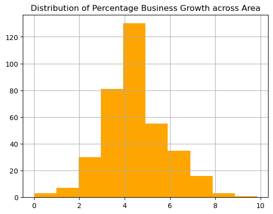

The histogram generally aligns with the boxplot, though the distribution is not perfectly symmetrical.
Most regions cluster in the 3%–6% business growth range around the median, indicating a common typical growth rate.
The bars taper off toward very low and very high growth values, showing that relatively few regions experienced extremely weak or exceptionally strong growth.
The roughly bell-shaped pattern suggests that growth rates are approximately normally distributed, with a single predominant cluster rather than multiple distinct groups of regions.

Then, the 5 UK areas with the highest growth rates and the 5 with the lowest growth   displayed.

```python
final_table.set_index('Area name')['Value (%) growth'].sort_values(ascending=False)
```
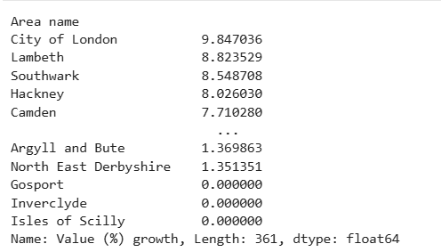

The top 5 areas that recorded the highest growth rates in 2024 were all London boroughs, respectively City of London (9.5%), Lambeth (8.8%), Southwark (8.5%), Hackney (8.0%) and Camden (7.7%).
In contrast, the 5 areas that recorded the slowest growth rates in 2024 were Isles of Scilly, Inverclyde and Gosport all recording 0% growth, followed by North East Derbyshire (1.4%) and Argyll and Bute (1.4%).

Next, a bar chart that displays the top 10 UK areas with the highest growth rates was created.

```python
top_10 = final_table.set_index('Area name')['Value (%) growth'].sort_values(ascending=False).head(10)
top_10.plot(kind='barh', color='violet')
plt.xlabel('Value (%) growth')
plt.ylabel('Area name')
plt.title('Top 10 Areas by Average growth in UK 2024')
plt.show()
```
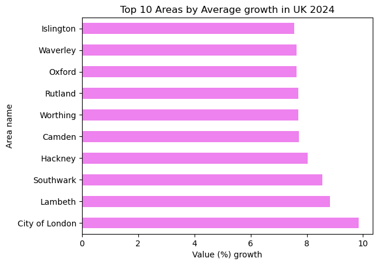

The chart indicates that several areas in London (City of London, Lambeth, Southwark, Camden and Islington) have very high growth rates. 
City of London recorded almost 10% growth, followed by Lambeth, Southwark and Hackney which recorded growth rates of approximately 8%-9%.
Outside of london, Worthing (Sussex), Wortham (Suffolk), Rutland(East Midlands), Waverley (Surrey) and Oxford (Oxfordshire) also show hight growth aroung 8%.

Now, we can create a map showing the geographical locations of the top 5 UK areas with the slowest growth rates in 2024 and the 5 areas with the highest growth rates.

First we have to create two variable, one with the top 5 areas recording the lowest business growth rates and the top 5 with the highest ones.

```python
top_5_hgr = final_table.nlargest(5, "Value (%) growth")
top_5_lgr = final_table.nsmallest(5, "Value (%) growth")
```
```python
top_5_hgr = set(top_5_hgr["Area name"])
top_5_lgr = set(top_5_lgr["Area name"])
```
```python
## Create the base map
Top5grmap = folium.Map(location=[54.5, -2], zoom_start=6)

folium.Choropleth(
    geo_data = "UKmap.geojson",
    fill_color = "Greys",
    fill_opacity = 0.2,
    line_opacity = 0.1,
    nan_fill_color = "lightgray"
).add_to(Top5grmap)
```    
```python
def Color_map_g(feature): # 'feature' = one geographic area (eg Camden/Lambeth..).
    area = feature["properties"]["LAD25NM"] # Indicates where the area names are located in the JSON file.

    if area in top_5_hgr:
        return{
            "fillColor": "green",
            "color": "black", # Outline colors
            "weight": 1, #thickness borders
            "fillOpacity": 0.8,
        }

    elif area  in top_5_lgr: # Else if
        return{
            "fillColor": "red",
            "color": "black",
            "weight": 1,
            "fillOpacity": 0.8,
        }

    else: # Otherwise
        return{
            "fillColor": "transparent",
            "color": "transparent",
            "weight": 0,
            "fillOpacity": 0,
        }
```
```python
folium.GeoJson(
    "UKmap.geojson",
    style_function = Color_map_g, #style_function() (Folium Library) is used to define the style of GeoJSON features (Polygons, lines).
    name = "top & Bottom 5 growth rates areas" # Name this layer
).add_to(Top5grmap)
```
```python
Top5grmap
```
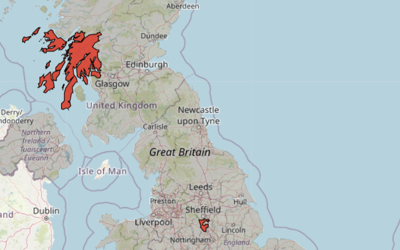

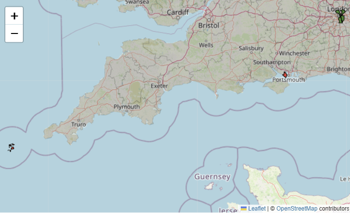

The map highlights that the five UK areas with the highest growth rates in the UK in 2024 were all located in London: City of London, Lambeth, Camden, Hackney and Southwark.
In contrast, the five UK areas with the lowest growth rates in 2024 were Argyll and Bute (Eastern Scotland) and its neighbour Inverclyde (Eastern Scotland), North East Derbyshire (Central England), the Isles of Scilly (off the west coast of England) and Gosport (Southern England).

Now let's creates a Chloropleth map of the growth rates in the UK in 2024

```python
# First create an empty base map
map = folium.Map(location=[54.5, -2], zoom_start=6) # After research, UK latitude is roughly 54.5 and longitude is roughly -2

# Then add layers on top of it
folium.Choropleth(
    geo_data="UKmap.geojson",
    data= final_table,
    columns=["Area name", "Value (%) growth"],
    key_on="feature.properties.LAD25NM", # path to area names in the GeoJSON file as previously observed.
    fill_color='YlGn', # Yellow to green
    fill_opacity = 0.7,
    line_opacity= 0.2,
    nan_fill_color="lightgray",
    legend_name = 'Value (%) growth'
).add_to(map)
```
```python
map
```
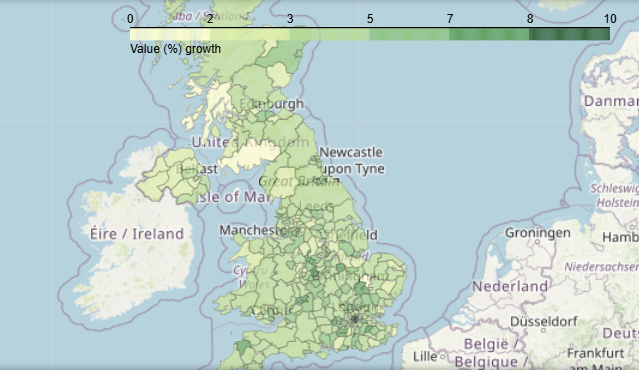

Overall, South East England, as well as eastern, western, and northern England, recorded an average growth rate of around 3% to 5% in 2024. This range represents the majority of UK local authorities, with a higher concentration of strong growth located in central and south-central England, particularly around major cities such as London, Cambridge, Oxford, Bristol, and Manchester.
Some areas stand out from their surrounding regions. For example, the High Devon area in the South West and the Lancashire region exhibit relatively high growth rates, despite neighbouring areas showing more moderate or lower growth.
In contrast, central Cambridgeshire, High Derby region and East Sussex (Hastings) are among the areas with the lowest growth rates in England.
In Scotland, the North East region around Aberdeen records the highest growth rates, while the north-west and central-west regions experience the lowest growth levels.
In Northern Ireland, business growth rates are generally lower than in the rest of the UK, with most areas recording growth between 2% to 3% except for south-eastern region, where growth ranges between 3% and 5%.

## Business termination rates

Let create a boxplot to visualise the distribution of business death rates.
```python
sns.boxplot(x='Value (%) death', data=final_table)

plt.title('Distribution of Percentage Business termination across Areas')
plt.show()
```
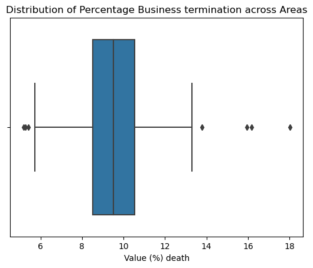

The whiskers extend from around 6%, indicating regions with lower levels of business termination, to 13-14% representing regions with higher business closure rate.
The interquartile range is relatively narrow compared to the full x-axis range, suggesting that the middle 50% of areas exhibit similar levels of business termination. Most typical regions fall roughly between 8% and 11%, indicating limited variation among the majority of areas.
The boxplot shows that the median percentage of new businesses across UK is around 10%. The median lies roughly in the center of the distribution, indicating that approximately half of the UK areas recorded experienced business death rates above this level, while the other half recorded lower rates.
The distribution is approximately symmetric, with the data being evenly spread out on both sides of the median and lower and upper halves of the data showing similar variability.
The plot indicates the presence of outliers at both ends of the distribution, with the high-value outliers being more widely spread, indicating greater variability among regions with exceptionally high rates

We can now create a histogram to visualise the distribution of business death rates by UK regions in 2024.

```python
final_table['Value (%) death'].hist(bins=20, color='orange')

plt.title('Distribution of Percentage Business termination across Areas')
plt.show()
```
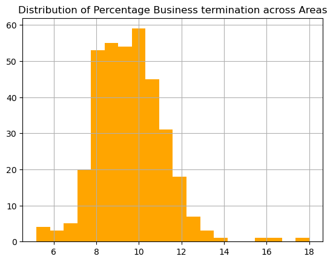

The histogram aligns with the boxplot, showing that most UK regions have business death rates between 8% and 11%. 
The roughly bell-shaped distribution indicates that values cluster around the median, suggesting a fairly normal distribution where most regions exhibit typical business activity with a slight right skew.
The noticeable spike around 10% highlights that a substantial number of regions share this specific level of new business formation in 2024, implying a common baseline of business deaths across many areas, while extreme values remain relatively rare.

Let's display the 5 UK areas recording the highest and lowest business termination rates in 2024.

```python
final_table.set_index('Area name')['Value (%) death'].sort_values(ascending=False)
```
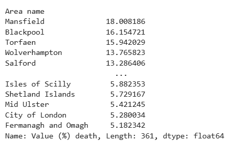

The top 5 areas with the highest business death rates in 2024 were Mansfield (%), Blackpool (16%), Torfaen (16%), Wolverhampton (14%) and Salford (13%).
In contrast, the 5 areas with the lowest business termination rates were Fermanagh and Omagh (5%), City of London (5%), Mid Ulster (5%), Shetland Islands (6%) and Isle of Scilly (5%).

We can now creates a bar chart that displays the top 10 UK areas that recorded the highest termination rates in 2024.

```python
top_10_death = final_table[['Area name', 'Value (%) death']] \
    .sort_values(by='Value (%) death', ascending=False) \
    .head(10)

top_10_death.plot(x='Area name', y='Value (%) death', kind='barh', color='violet', legend=False)
plt.xlabel('Value (%) death')
plt.ylabel('Area name')
plt.title('Top 10 Areas by death Percentage in UK in 2024')
plt.show()
```
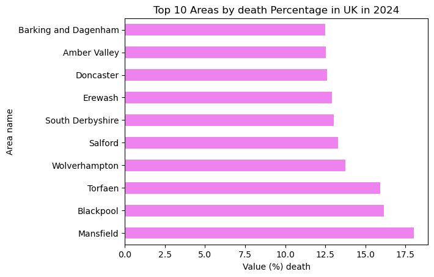

Create a map that highlight only the 5 areas with the lowest business termination rates and the 5 areas with the highest ones.

First we have to create two variable, one with the top 5 areas recording the lowest business termination rates and the top 5 with the highest ones.

```python
top_5_hdr = set(final_table.nlargest(5, "Value (%) death")["Area name"])
top_5_ldr = set(final_table.nsmallest(5, "Value (%) death")["Area name"])
```
```python
# Create the base map
top5drmap = folium.Map(location=[54.5, -2], zoom_start=6) # After research, UK latitude is roughly 54.5 and longitude is roughly -2

folium.Choropleth(
    geo_data="UKmap.geojson",
    fill_color="Greys",
    fill_opacity=0.2,
    line_opacity=0.1,
    nan_fill_color="lightgray"
).add_to(top5drmap)
```
```python
def Color_map_d(feature):# 'feature' = one geographic area (eg Camden/Lambeth..).
    area = feature["properties"]["LAD25NM"] #Properties > LAD25NM (area names in the GeoJSON file)
    
    if area in top_5_hdr:
        return{
        "fillColor": "red", # filling colour
        "color": "black", # outline colour
        "weight": 1, #thickness borders
        "fillOpacity": 0.8,
    }
    elif area in top_5_ldr: #else if
        return{
        "fillColor": "green",
        "color": "black",
        "weight": 1,
        "fillOpacity":0.8,
    }
    else:
        return{
        "fillColor":"transparent",
        "color": "transparent",
        "weight": 0,
        "fillOpacity":0,
    }
```
```python
#Add a single GeoJson layer
folium.GeoJson(
    "UKmap.geojson",
    style_function=Color_map_d, #style_function() (Folium Library) is used to define the style of GeoJSON features (Polygons, lines).
    name="top & Bottom 5" # give a name to this layer
).add_to(top5drmap)

# Display map
top5drmap
```
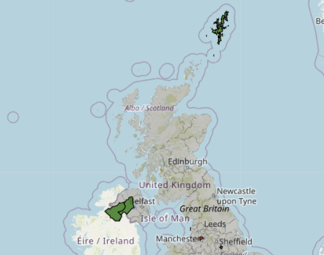
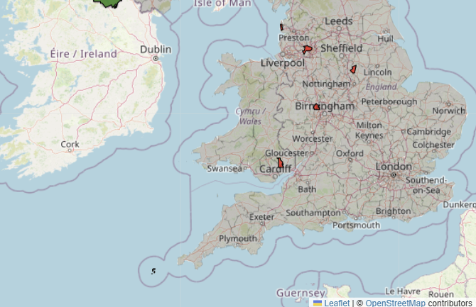

The map highlights the top 5 areas that experienced the lowest business termination rates in 2024.
We can see that the top 5 is divided in three countries: the Shetland Islands in Scotland, the Fermanagh and Omagh region and the Mid-Ulster region in South-western part of Northern Ireland and City of London and Isles of Scilly for England.
In contrast, within the top 5 areas with the highest business death rates in 2024, four are located in England:
Mansfield, Blackpool, Wolverhampton, Salford (Manchester), while one (Torfaen) is located in Wales.

```python
dmap = folium.Map(location=[54.5, -2], zoom_start=6) # Create map 

folium.Choropleth(  # Add instructions
    geo_data="UKmap.geojson",
    data= final_table,
    columns=["Area name", "Value (%) death"],
    key_on="feature.properties.LAD25NM",
    fill_color='YlGn',
    fill_opacity = 0.7,
    line_opacity= 0.2,
    nan_fill_color="lightgray",
    legend_name = 'Value (%) death'
).add_to(dmap) # Add to map
```

```python
dmap
```
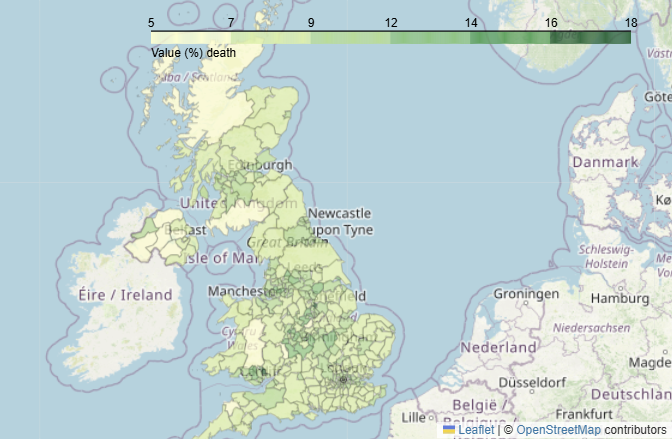

In Northern Ireland, the Strabane/Derry region records the highest business death rates, ranging from 9% to 12%. Eastern regions follow with rates around 7% to 9%, while most of the rest of Northern Ireland experiences lower rates of 5% to 7%.
In Scotland, most areas have death rates between 7% and 9%. Some regions, such as Dumfries & Galloway (Southern Scotland) and Highland (Northern Scotland), have lower rates of 5% to 7%. In contrast, the areas around Glasgow and Edinburgh show higher rates, ranging from 9% to 12%.
In Wales, the majority of local authorities have death rates around 7% to 9%, except for Powys, which is lower (5% to 7%), and Torfaen, which is notably high, between 16% and 18%.
In England, most local authorities experience business death rates of 7% to 9%. Some areas, such as Malvern Hills (Worcestershire), North West Leicestershire, and Torridge (Devon), are lower at 5% to 7%. Around major cities like London, rates vary more: the highest are in Mansfield (Nottinghamshire) and Blackpool, reaching 16% to 18%, while other urban areas, particularly near Birmingham, show rates between 12% and 16%.

## New businesses rates 

A boxplot have been created to visualise the distribution of business creation rates.

```python
sns.boxplot(x='Value (%) New', data=final_table)

plt.title('Distribution of Percentage Business creation across Areas')
plt.show()
```
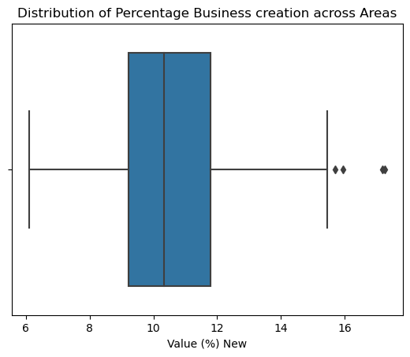

The whiskers extend from around 6%, indicating regions with weaker entrepreneurial activity, to 15-16% representing stronger-performing regions.
The boxplot shows that the median percentage of new businesses across UK is around 10-11%. The median lies slightly closer to the lower end of the distribution, indicating that more than 50% of UK areas recorded over 10% new businesses in 2024.
The interquartile range is relatively narrow compared to the full x-axis range, suggesting that the middle 50% of areas are fairly similar in terms of enterprise formation. Most typical areas fall roughly between 9% and 12%, indicating limited variation.  .
The distribution is positively skewed, with a slightly longer right-hand tail extending toward higher values. While most regions clusters around the median, several high-end outliers are present, likely reflecting major cities with exceptionally large numbers of new enterprises.

Now let's create a histogram to visualize the distribution of new business percentages across regions,

```python
# using 20 bins, based on the range observed in the boxplot
final_table['Value (%) New'].hist(bins=20,color='orange')

plt.title('Distribution of Percentage Business creation across Areas')
plt.show()
```
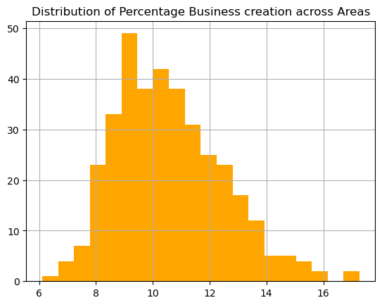

The histogram aligns with the boxplot, showing that most UK regions have business formation rates between 9% and 11%. 
The roughly bell-shaped distribution indicates that values cluster around the median, suggesting a fairly normal distribution where most regions exhibit typical business activity. The noticeable spike around 9% highlights that a substantial number of regions share this specific level of new business formation in 2024,
implying a common baseline of entrepreneurial activity across many areas, while extreme values remain relatively rare.

Let's display the 5 UK areas with the highest business creation rates in 2024 and the 5 with the lowest ones.

```python
final_table.set_index('Area name')['Value (%) New'].sort_values(ascending=False)
```
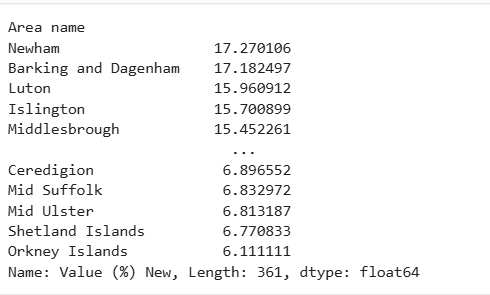

The UK areas with the highest business creation rates in 2024 were Newham (17%), Barking and Dagenham (17%), and Luton (16%). 
In contrast, the UK areas with the lowest business creation rates were Orkney Islands (6%), Shetland Islands (7%) and Mid Ulster (7%).

Let's create a DataFrame containing the top 10 UK areas with the highest business creation rates in 2024
```python
top_10_new = final_table[['Area name','Value (%) New']]\
    .sort_values(by='Value (%) New', ascending=False)\
    .head(10)
```
```python
top_10_new.plot(x='Area name',y='Value (%) New',kind='barh',color='violet',legend=False) # y=Index, x=Values
plt.xlabel('Value (%) New')
plt.ylabel('Area name')
plt.title('Top 10 UK areas by business creation rates in 2024')
plt.show()
```
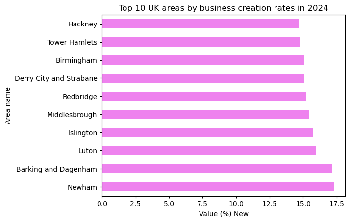

Let's create a map that highlight only the 5 areas with the lowest business creation rates and the 5 areas with the highest ones.

```python
# First we have to create two variable, one with the top 5 areas recording the lowest business creation rates and the top 5 with the highest ones.
top_5_hcr = set(final_table.nlargest(5, "Value (%) New")["Area name"])
top_5_lcr = set(final_table.nsmallest(5, "Value (%) New")["Area name"])
```
```python
# Create base maptop5drmap = folium.Map(location=[54.5, -2], zoom_start=6) # After research, UK latitude is roughly 54.5 and longitude is roughly -2
top5crmap = folium.Map(location=[54.4, -2], zoom_start=6)
```
```python
# Add layers to the base map
folium.Choropleth(
    geo_data='UKmap.geojson',
    fill_color="Greys",
    fill_opacity=0.2,
    line_opacity=0.1,
    nan_fill_color='lightgray').add_to(top5crmap)
```
```python
# Define a function 'Color_map_c' that takes a GeoJSON feature (a single geographic area) 

def Color_map_c(feature):# 'feature' = one geographic area (eg Camden/Lambeth..).
    area = feature["properties"]["LAD25NM"] # Extract the area name from the GeoJSON properties. Properties > LAD25NM (area names in the GeoJSON file)
  
    if area in top_5_hcr:
        return{
        "fillColor": "green", # filling colour
        "color": "black", # outline colour
        "weight": 1, #thickness borders
        "fillOpacity": 0.8,
    }
    elif area in top_5_lcr: #else if
        return{
        "fillColor": "red",
        "color": "black",
        "weight": 1,
        "fillOpacity":0.8,
    }
    else:
        return{
        "fillColor":"transparent",
        "color": "transparent",
        "weight": 0,
        "fillOpacity":0,
    }
```
```python
#Add function instructions to map
folium.GeoJson(
    "UKmap.geojson",
    style_function=Color_map_c, #style_function() (Folium Library) is used to define the style of GeoJSON features.
    name="top & Bottom 5" # give a name to this layer
).add_to(top5crmap)

# Display map
top5crmap
```
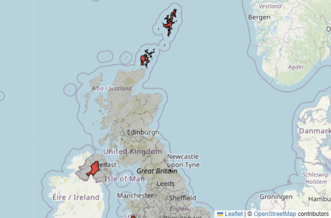
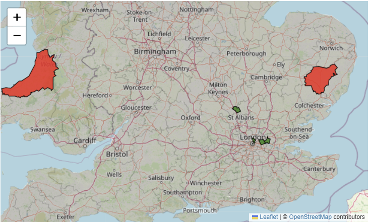

Among the five UK areas with the lowest business creation rates in 2024, two were in Scotland (Orkney Islands and Shetland Islands), one in Northern Ireland (Mid Ulster), one in Wales (Ceredigion), and one in England (Mid Suffolk).
In contrast, all five areas with the highest business creation rates were in England, including three in the Greater London area (Newham, Barking and Dagenham, and Islington), as well as Luton and Middlesbrough.

```python
nmap = folium.Map(location=[54.5, -2], zoom_start=6)

folium.Choropleth(
    geo_data="UKmap.geojson",
    data= final_table,
    columns=["Area name", "Value (%) New"],
    key_on="feature.properties.LAD25NM",
    fill_color='YlGn',
    fill_opacity = 0.7,
    line_opacity= 0.2,
    nan_fill_color="lightgray",
    legend_name = 'Value (%) New'
).add_to(nmap)

nmap
```
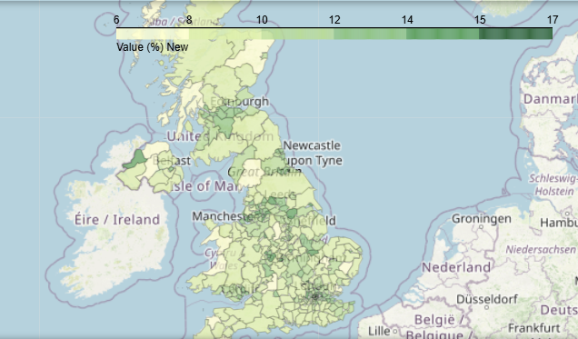

In Northern Ireland, the Strabane/Derry region records the highest business birth rates, ranging from 14% to 15%, while Belfast is slightly lower at 12% to 14%. Most of the rest of Northern Ireland falls between 8% and 10%, except for central Northern Ireland, where rates are particularly low, around 6% to 8%.
In Scotland, the majority of areas have business birth rates between 8% and 10%. Certain regions have very low rates, ranging from 6% to 8%, including Aberdeenshire (Eastern Scotland), Eilean Siar (Western Isles), Argyll & Bute (Western Scotland), and some of the Northern Islands. In contrast, areas around Glasgow and Edinburgh experience higher birth rates, approximately 13% to 14%.
In Wales, most local authorities report business birth rates of 8% to 10%. Gwynedd and Ceredigion in Western Wales have lower rates, around 6% to 8%, while Cardiff and its surrounding areas are higher, ranging from 10% to 12%, with the highest nearby, reaching 12% to 14%.
In England, most local authorities see business birth rates of 8% to 10%. Some areas near major cities have higher rates of 14% to 15%, reaching up to 16% in London and Middlesbrough. Conversely, areas such as Mid Suffolk, East Cambridgeshire, and Derbyshire Dales exhibit lower rates, around 6% to 8%.

## Business Closures VS Creations

Below are the areas with the highest net change (more business creations than closures) and the lowest net change (more business closures than creations).

```python
final_table.set_index('Area name')['net change'].sort_values(ascending=False)
```
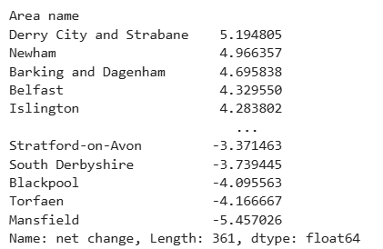

Negative values indicate areas where there were more business closures than creations in 2024, while positive values indicate areas where business creations exceeded closures.

The results show that the areas with the highest positive net change were Derry City and Strabane (5%), Newham (5%), and Barking and Dagenham (5%), meaning these areas experienced the strongest net business growth.
In contrast, the areas with the lowest net change were Mansfield (-5%), Torfaen (-4%), and Blackpool (-4%), indicating that closures outnumbered new business creations in these locations.

```python
ncMap = folium.Map(location = [54.5 , -2], zoom_start=6)

folium.Choropleth(
    geo_data = 'UKmap.geojson',
    data = final_table,
    columns = ['Area name', 'net change'],
    key_on = 'feature.properties.LAD25NM',
    fill_color = 'RdYlGn',
    fill_opacity = 0.7,
    line_opacity = 0.2,
    nan_fill_color = 'lightgray',
    legend_name = 'Net change by area'
).add_to(ncMap)

ncMap
```
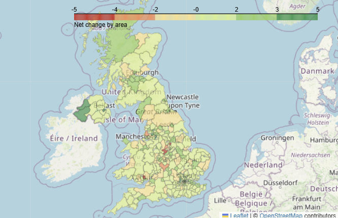

The map shows that most areas in the UK recorded a net business change between 0% and 2%, indicating that, in general, business creation either slightly exceeded or roughly matched business closures. This suggests that most regions did not experience an overall business decline in 2024.
However, approximately one quarter of UK areas recorded a negative net change (between -2% and 0%), meaning that business closures slightly outnumbered new business creations in those regions.
Overall, net change rates appear relatively homogeneous across the UK. Northern Ireland stands out, as none of its regions recorded a strongly negative net change.

## Correlations

Now that each variable has been analysed independently, we will run correlation analyses to explore potential relationships between them.
    
Beacause Data are continuous (Counts/ percentages) and not normally distributed (data are skewed), we will perform a Spearman correlation.

```python
cols =["Value (number of enterprises)", # Select only the 4 variable that we need
    "Value (%) New",
    "Value (%) death",
    "Value (%) growth"]

df = final_table[cols]
```
```python
# Run Spearman correlation
corr_spearman = df.corr(method="spearman")

print(corr_spearman)
```
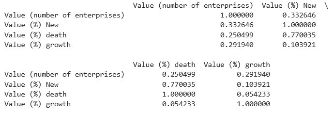

### Correlation Heatmap

To better visualize the relationships between variables, we will create a correlation heatmap.

```python
import seaborn as sns # For correlation heat map
```
```python
plt.figure(figsize=(8,6))
sns.heatmap(corr_spearman,
    annot=True, # Display values
    cmap="coolwarm",
    fmt=".2f") # format = .2f = format the number to 2 decimal places
plt.title("Spearman correlation Matrix (UK cities, 2024)")

plt.show()
```
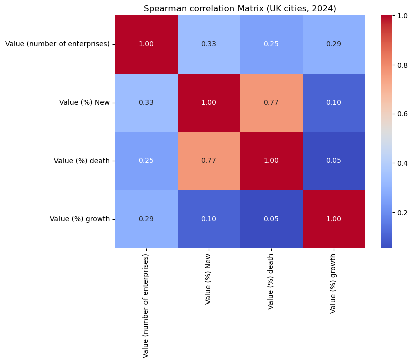

The heatmap shows a strong positive correlation of 0.77 between ‘Value (%) death’ and ‘Value (%) New’, indicating a strong relationship between business creation and closure.

### Scatterplot

To examine the relationship between new business formation and business closures, we will create a scatterplot to identify any patterns and trends. 

```python
plt.figure(figsize=(7,5))
plt.scatter(df["Value (%) New"],
            df["Value (%) death"])

plt.xlabel("New businesses (%)")
plt.ylabel("Businesses closure (%)")
plt.title("New vs closed Businesses by UK areas in 2024")

plt.show()
```
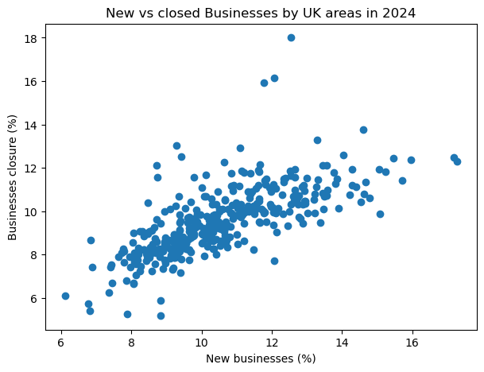

The scatterplot shows a clear positive correlation between the two variables while also highlighting the presence of several outliers.
As business creation increases, business closures also tend to increase.

### Check for significance

In order to determine whether the observed correlation is likely real and not just due to random chance, we will perform a statistical significance test by calculating the correlation coefficient along with its p-value.

```python
from scipy.stats import spearmanr ## for the p value

x=df["Value (%) New"]
y=df["Value (%) death"]

corr, p_value = spearmanr(x, y)

print("Spearman correlation", corr)
print("p-value", p_value)
```
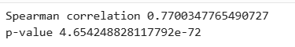

 p<.001, therefore the probability of seeing this correlation by random chance is practically zero. Results are extremely significant, suggesting that the association is reliable.

There is a strong positive correlation (Spearman's ρ = 0.77, p<.001) between new business formation and business deaths across cities.
Cities with higher rates of new business creation also tend to experience higher rates of business closures, suggesting high business turnover in more dynamic urban economies. While the relationship is strong, correlation does not imply causation; both indicators likely reflect overall market dynamism.

```python
get_ipython().system('jupyter nbconvert --to script buisnesses.ipynb') ##Save Py file everytime i rerun the whole file.
```
# Conclusion

Overall, the analysis shows that UK business dynamics in 2024 are highly uneven across local authorities, with strong concentrations of enterprises and growth in and around major urban areas, while more remote and rural regions tend to lag behind.​

### Core national picture
Across the 361 areas, business creation slightly exceeds business closure on average, with mean new business creation around 10.6% and mean business termination rates about 9.6%, implying modest net expansion in the business population. Only a small proportion of firms achieve high growth (around 4.5% on average), which shows that strong employment expansion is uncommon compared with the general pattern of businesses starting up and closing down  Most areas record net change between roughly -2% and +2%, suggesting that for the majority of UK areas, 2024 was a stable year with modest net growth rather than dramatic structural shifts.​

### Spatial concentration and regional inequality
Enterprise numbers are highly right‑skewed, with a few local authorities (especially London boroughs and major cities such as Westminster, Camden and Birmingham) hosting very large business populations and many smaller authorities hosting comparatively few enterprises. The Isles of Scilly, Orkney Islands and Na h‑Eileanan Siar sit at the very bottom of the distribution, highlighting how peripheral island and rural areas remain disadvantaged in terms of business presence. Choropleth maps reinforce this pattern by showing that high enterprise counts cluster mainly around London, large English counties such as North Yorkshire and key Scottish regions like Aberdeenshire, while much of the rest of the UK register fewer businesses.​

### Growth, births and deaths: an urban turnover story
Business growth rates cluster around 4%–5% and are highest in a small number of London boroughs (City of London, Lambeth, Southwark, Hackney, Camden), indicating that the most intense employment expansion is heavily urban and capital‑centric. In contrast, some peripheral or structurally weaker areas (Isles of Scilly, Inverclyde, Gosport, North East Derbyshire, Argyll and Bute) record minimal or complete business stagnation. A similar urban pattern emerges for business creation: the highest birth rates are concentrated in London and a few English authorities such as Newham, Barking and Dagenham, Luton and Middlesbrough, while the lowest birth rates are observed in the Scottish islands, Mid Ulster and other rural counties.
Business death rates also show moderate dispersion, with most areas falling between 8% and 11%, but with striking peaks in Mansfield, Blackpool, Torfaen, Wolverhampton and Salford, where closure rates are very high. On the other end, places like Fermanagh and Omagh, Mid Ulster, Shetland Islands, City of London and Isles of Scilly exhibit notably low death rates, suggesting either more resilient business bases or different local conditions and structures. After combinining business closures and creations, net change is strongest in Derry City and Strabane, Newham and Barking and Dagenham (5%) and weakest in Mansfield, Torfaen and Blackpool (-4% to -5%), making it clear that some local economies are growing while others are declining.
​
### Correlation and turnover
The correlation analysis reveals a strong positive association between business birth and death rates (Spearman ρ ≈ 0.77, p < .001), implying that areas with more new enterprises also tend to have more closures. This pattern further indicates that dynamic areas experience a high turnover in both business creation and, consequently, failure rates. These dynamic areas, due to higher levels of business experimentation, greater costs, and stronger competition, may face increased chances of failure.
Therefore, it is important to interpret high birth rates alongside equally high closure rates rather than as unquestionable signs of strength.
​
### Implications
The findings suggest several priorities. It is important to support lagging rural and peripheral regions that experience both low business counts and weak growth. To do so, policymakers should address abnormally high closure rates in specific areas such as Mansfield, Blackpool, and Torfaen, and design interventions in high-turnover urban economies to help viable new firms survive beyond the initial start-up phase.​

### Limitations
It is important to note that the analysis focuses only on a single year (2024) and does not account for the number of years enterprises were operating before closure. Furthermore, the datasets solely rely on VAT/PAYE‑registered enterprises and use aggregated local authority data, which do not account for differences within areas and sectors.  

### Futher work
Future work could extend this report by comparing this analysis with previous years and/or by focusing on business sectors within different UK areas. Further work could also examine business productivity by UK area in order to better understand local economic performance and growth potential.
